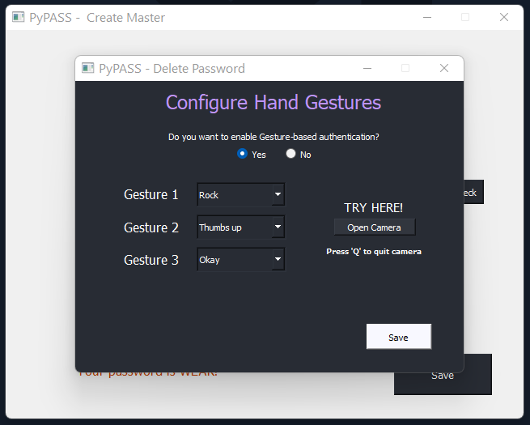
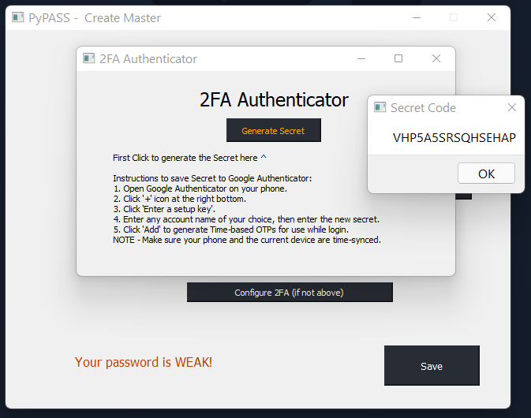
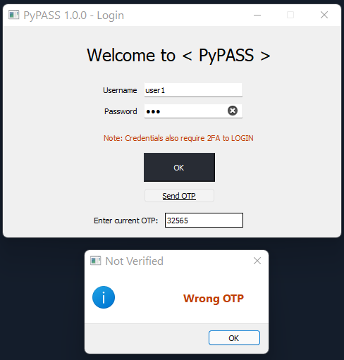
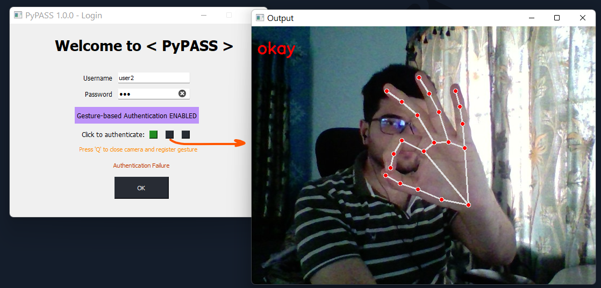
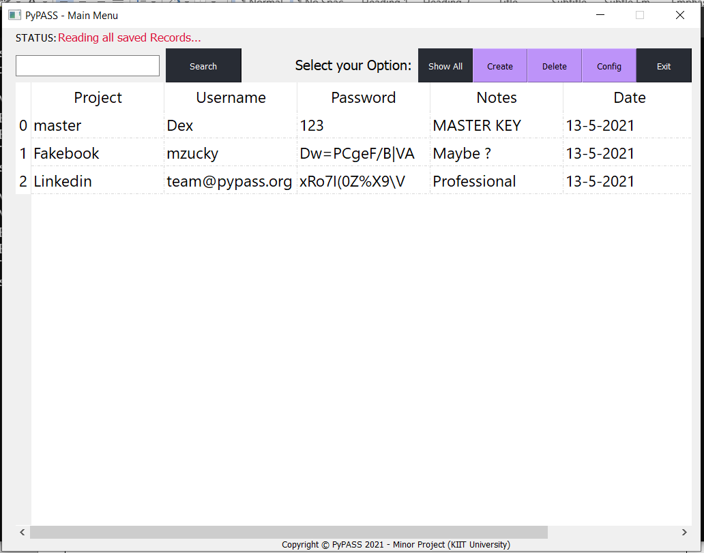
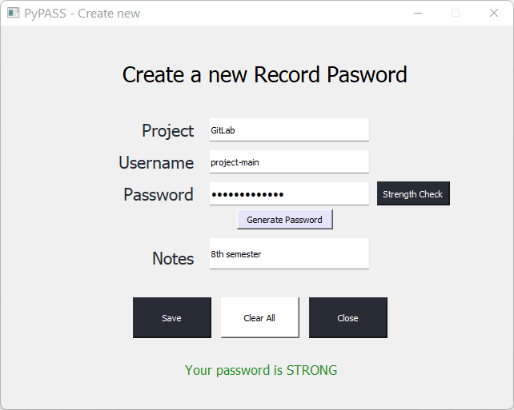

# PyPASS Desktop Password Manager v2 (2022)

#### Read about the Project [ here ](https://github.com/dexter-11/PyPASS/blob/main/About%20PyPASS.pdf)
#### Read about the latest improvements [ here ](https://github.com/dexter-11/PyPASS/blob/main/About_PyPASS_2022-Updated.pdf)

## Installation:
Python > 3.7 required.

```bash
python -m venv project_env --system-site-packages

# USE PYTHON VIRTUAL ENV FOR THE PROJECT TESTING (Recommended)
cd .\project_env\Scripts\
.\activate

pip install -r reqs.txt
python3 pypass.py

.\deactivate
```

## Features:
- Completely offline and Python-based
- User-friendly GUI now with Dark elements
- In-built Password strength analyzer and Random password generator
- AES 256 Encrypted database
- Now with 2FA integration enabled:
  - Time-based OTP verification (Google Authenticator compatible)
  - *NEW* Hand Gesture-based 2-factor authentication

#### Other people involved
Tushar Abir, [ Sambeet Pani ](https://github.com/theskp), [ Devyansh Singh ](https://github.com/DevDnoC)
- - -
## Preview:
<p float="left">
  
  
  
  
  
  
  
</p>

For more, check out the [ App Preview ](https://github.com/dexter-11/PyPASS/tree/main/app_preview)

- - -
